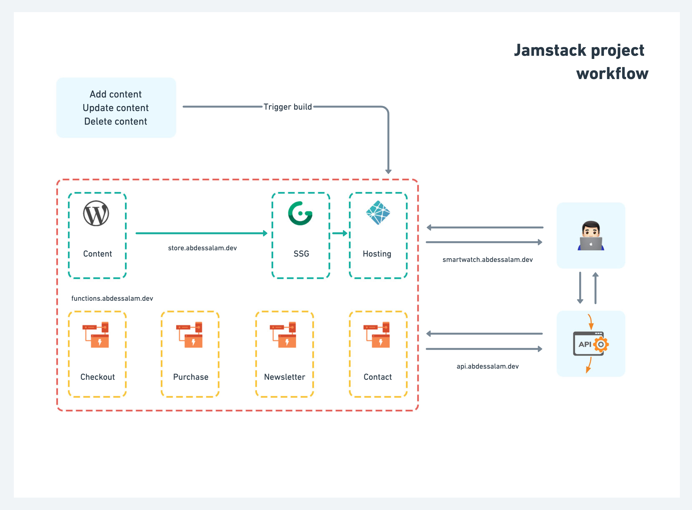

# Smartwatch app

## Preview


## Workflow



### Site
https://github.com/itsabdessalam/smartwatch-app available at https://smartwatch.abdessalam.dev/

### Node.js API
https://github.com/itsabdessalam/smartwatch-api available at http://api.abdessalam.dev/

### WordPress API
https://github.com/itsabdessalam/smartwatch-wp available at https://store.abdessalam.dev/

### Netlify functions
https://github.com/itsabdessalam/smartwatch-functions available at https://functions.abdessalam.dev/

## 📦 Requirements

This project should be working as expected with the following minimal version of:

| Dependency |   Version   |
| ---------- | :---------: |
| Node       | >= v12.14.1 |
| npm        | >= v6.14.5  |
| Gridsome   |  >= 0.7.0   |

## 🔒Environment variables

```text
GRIDSOME_API_URL_WP=""
GRIDSOME_API_URL_NEWSLETTER=""
GRIDSOME_LOCAL_STORAGE_PREFIX=""
GRIDSOME_STRIPE_SECRET_KEY=""
GRIDSOME_STRIPE_PUBLIC_KEY=""
GRIDSOME_API_STRIPE_CHECKOUT=""
GRIDSOME_API_URL_CONTACT=""
```

## 🚀 Quick start

1. **Clone the git repository**

    ```bash
    # cloning git repository into `mysmartwatch-app` folder
    git clone https://github.com/itsabdessalam/smartwatch-app mysmartwatch-app

    # install project dependencies
    cd mysmartwatch-app && npm install
    ```

2. **Start Developing**

    **Dev Version**

    ```bash
    gridsome develop
    ```

    **Prod Version**

    ```bash
    gridsome build
    ```

3. **Open browser and start editing files!**

    > Project is running at <http://localhost:8080>

## 🧐 What's inside?

```
.
├── node_modules        # This is the directory of the modules (npm packages) for the project
├── static              # Static folder
├── config
├── utils
├── services
├── src                 # This is the directory of files related to the project app
|   ├── assets
|   |   ├── fonts
|   |   ├── images
|   |   └── stylesheets
|   ├── components
|   ├── pages
|   ├── filters
|   ├── layouts
|   └── store
|       ├── modules     # This is the modules folder, eq: auth, cart...
|       └── index.js    # This file allows assemble modules and export the store
├── .gitignore          # This file tells git which files it should not track
├── .eslintrc.js        # This is the configuration file for ESLint
├── .prettierrc.js      # This is the configuration file for Prettier
├── babel.config.json   # This is the configuration file for babel
├── gridsome.config.js
├── gridsome.server.js
├── package.json        # This file tells npm which packages to install for the project
├── .env
└── README.md
```

## Author

Abdessalam BENHARIRA